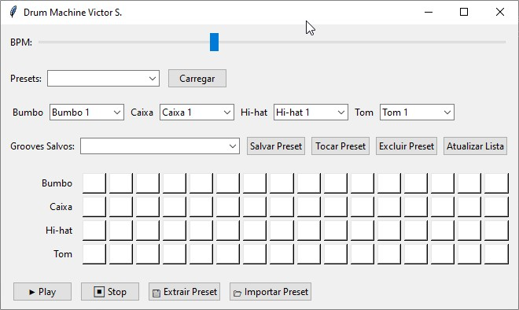
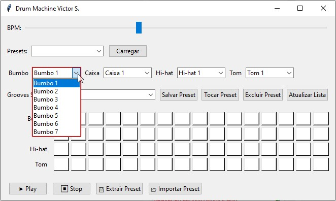

# 🥁 Drum Machine Victor S. - app_drum2.0

O **app_drum2.0** é a nova versão do meu projeto de Drum Machine em Python.  
Ele nasceu como evolução do **app_drum (primeira versão)**, trazendo várias melhorias, novas funcionalidades e uma estrutura mais robusta.

---

## 🚀 Evolução em relação ao app_drum

### 🔹 Versão antiga (app_drum)
- Sequenciador simples em Tkinter.
- Reprodução de samples via Pygame.
- Apenas um loop básico por instrumento.
- Sem banco de dados.
- Não era possível salvar ou carregar grooves.
- Apenas um executável simples via PyInstaller.

### 🔹 Nova versão (app_drum2.0)
- ✅ **Presets de ritmos** (Reggae, Rock, Samba e outros).  
- ✅ **Sequencer 16 passos** totalmente editável.  
- ✅ **Banco de dados SQLite integrado** para salvar e carregar grooves.  
- ✅ **Salvar/abrir em JSON**, permitindo exportar/importar padrões.  
- ✅ **Escolha de timbres** para cada instrumento (kick, snare, hat, tom).  
- ✅ **Controle de BPM dinâmico** com ajuste em tempo real.  
- ✅ **Interface aprimorada** com destaque visual do passo ativo.  
- ✅ **Gerador de executável único** (.exe) com PyInstaller.  
- ✅ Preparado para **atualização automática** futura (checagem na nuvem).  

---

## ⚔️ Desafios enfrentados

- **Sincronização do sequencer**: ajustar o tempo de execução (BPM) e manter a reprodução estável sem travar a interface Tkinter.  
- **Integração do banco SQLite**: criar funções para salvar, carregar e excluir grooves com segurança.  
- **Gestão de samples**: organizar as pastas por instrumentos e garantir compatibilidade entre diferentes timbres.  
- **Compatibilidade do executável**: empacotar com PyInstaller sem quebrar a estrutura de pastas (samples + banco de dados).  
- **Evolução da interface gráfica**: melhorar usabilidade, deixando mais intuitivo sem poluir a tela.  

---

## 🎯 Próximos passos

- Implementar **atualização automática** via nuvem (Google Drive / GitHub Releases).  
- Adicionar **mais presets prontos** de ritmos populares (funk, bossa nova, pop, trap).  
- Criar **suporte a múltiplos canais de áudio** (mais instrumentos).  
- Exportar grooves como **áudio (.wav)**.  

---

## **🖼 Interface**

*Interface Nova.*

*Seleção de presets e grooves na Library interna novos.*

*Diferentes timbres de bateria.*

---

## 📜 Licença

Projeto open-source para estudo, aprendizado e diversão musical. 🎶
